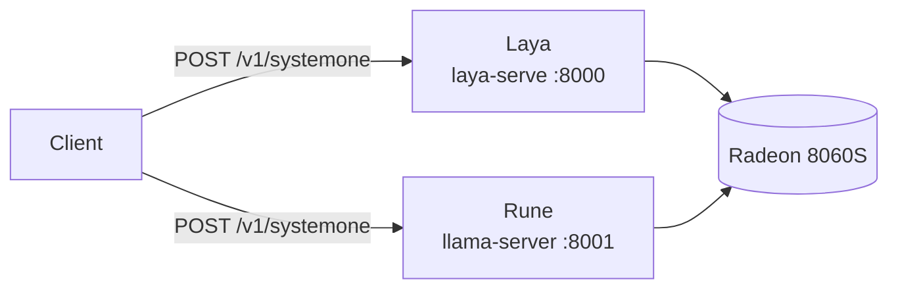
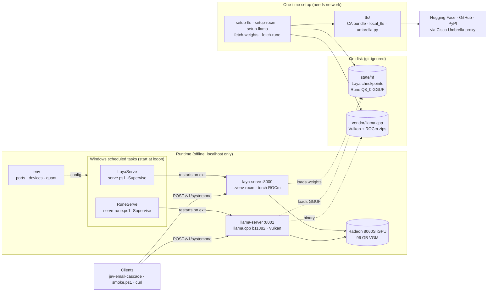

# local-decision-model

Local hosting for open-weight **decision models** on this Strix Halo box (Ryzen AI MAX+ 395 / Radeon 8060S, Windows 11, Python 3.13). Both servers speak TypeSafe Jev's `POST /v1/systemone` wire protocol, so one client talks to either:

| model | server | port | GPU path | task |
| --- | --- | --- | --- | --- |
| **Laya** (Convai Innovations, 421M encoder; PyPI `laya` 0.3.26) | `laya-serve` | 8000 | ROCm torch (`.venv-rocm`) | `LayaServe` |
| **Rune 26B-A4B v3** (Invergent, Gemma 4 MoE, 4B active) | llama.cpp `llama-server` b11382 | 8001 | Vulkan | `RuneServe` |

This project was named `laya-host` until Rune was added.

## Architecture

At runtime:



All the moving parts, including setup:



- **Clients** send the same request to either server. The protocol is Jev's `POST /v1/systemone`: a state plus typed questions in, typed answers with probabilities out.
- **Scheduled tasks** keep the servers up. Each runs a small PowerShell supervisor, which restarts its server whenever it exits. `.env` decides ports, devices and which Rune quant to load.
- **Two servers share the iGPU:**
  - Laya runs through `laya-serve` on AMD's ROCm build of torch.
  - Rune runs through llama.cpp's `llama-server` on Vulkan. That's the only llama.cpp build that sees this GPU.
- **Everything at runtime is local.** Both servers bind to 127.0.0.1 and load weights from `state/hf` with `HF_HUB_OFFLINE=1`.
- **Network is only needed for setup.** The setup scripts download weights, the ROCm torch wheels and the llama.cpp zips. They go through `tls/` because the corporate Cisco Umbrella proxy re-signs and redirects those downloads; see [Why it is shaped like this](#why-it-is-shaped-like-this).

`laya-serve` routes:

| route | purpose |
| --- | --- |
| `GET /health` | resident checkpoints, revision SHAs, and the device each one actually computes on |
| `POST /v1/systemone` | one state + typed questions (`choice` / `score` / `noul`) |
| `POST /v1/systemone/batch` | up to 64 states sharing one question set |

`llama-server` has `GET /health`, `GET /props` (GGUF path and build) and `POST /v1/systemone`. It has no batch route; it runs `RUNE_PARALLEL` requests in parallel instead.

Request shape (the guide this started from had it wrong):

```json
{"state": {"subject": "...", "body": "..."},
 "questions": {
   "dept":    {"type": "choice", "instructions": "Which team?", "criteria": {"billing": "refunds", "tech": "bugs"}},
   "urgency": {"type": "score",  "instructions": "How urgent?", "criteria": ["routine", "soon", "blocking"]},
   "cancel":  {"type": "noul",   "instructions": "Does the customer explicitly threaten to cancel?"}},
 "model": "typed-decisions"}
```

`model` is optional and Laya-only (`english` / `typed-decisions` / `multilingual`). If you leave it out, Laya's router chooses.

## Setup (one time): Laya

```powershell
uv sync                                   # .venv on Python 3.13
.\scripts\setup-tls.ps1                   # CA bundle + Python 3.13 strict-X509 hook (corporate proxy)
Copy-Item .env.example .env
.\scripts\fetch-weights.ps1               # ~2.3 GB into state\hf, through the proxy
.\scripts\install-task.ps1 -StartNow      # scheduled task "LayaServe": starts at logon, restarts on failure
.\scripts\smoke.ps1                       # health + one typed request
```

For the GPU, which is the default in `.env.example`, also run:

```powershell
.\scripts\setup-rocm.ps1                  # .venv-rocm: AMD's torch 2.11.0+rocm7.13.0 for gfx1151
```

## Setup (one time): Rune

```powershell
.\scripts\setup-llama.ps1                 # llama.cpp b11382 win-vulkan + win-rocm zips -> vendor\llama.cpp\
.\scripts\fetch-rune.ps1 Q8_0 BF16        # 25 GB + 47 GB into state\hf, through the proxy
.\scripts\install-task.ps1 -Model rune -StartNow
.\scripts\smoke.ps1 -Server rune
```

The weights are `owao/surogate-rune-26b-a4b-systemone` at revision `f6cf5c19`. These are Invergent's weights, unmodified, with five GGUF header keys added: decision type `openjev`, temperature 2 per question type, and the surogate decision prompt template. With those keys, `llama-server` (b11371 and later, PR #29818) serves `/v1/systemone` for Rune with no extra flags. The official repo (`surogate/rune-26b-a4b-GGUF`) is gated, holds bf16 safetensors, and is meant for Invergent's surogate engine on NVIDIA. Rune's optional `thinking` mode exists only in surogate, so here Rune runs single-pass, which is the 57.44 Decision Index configuration.

`.env` picks the quant (`RUNE_GGUF`), the llama.cpp build (`RUNE_LLAMA_BACKEND`), the context (`RUNE_CTX`), the parallel slots (`RUNE_PARALLEL`) and the micro-batch (`RUNE_UBATCH`, default 512). Only the Vulkan build sees the 8060S: the official `win-rocm` zip lists no devices with this driver.

**Use Q8_0, the default.** BF16 (47 GB) loads, but every request fails with `vk::Queue::submit: ErrorDeviceLost` on b11382 Vulkan with driver 32.0.31041, even at `RUNE_UBATCH=128`. The device-lost state leaves the GPU in a bad state until a restart. Livesport's measurements put Q8_0 at 98.7% top-option agreement with bf16 (KL 0.0094).

## Results (jev-email-cascade, 74 labelled emails, 8 questions each)

Measured 2026-10-04 with `cascade run --backend laya|rune` and `scripts/bench_laya.py` in [jev-email-cascade](https://github.com/skiingfalcon/jev-email-cascade). Jev and frontier are the hosted baselines.

| model | category acc | macro F1 | priority exact / ±1 | noul Brier / ECE | p50 per email | throughput | GPU memory |
| --- | ---: | ---: | ---: | ---: | ---: | ---: | ---: |
| Jev 1.13 (hosted) | 0.959 | 0.955 | 0.784 / 0.919 | 0.079 / 0.097 | 272 ms | | |
| gpt-5.6-terra (hosted) | 0.973 | 0.967 | 0.905 / 1.000 | 0.071 / 0.072 | 1,600 ms | | |
| **Rune 26B-A4B v3 Q8_0**, Vulkan | **0.959** | **0.958** | 0.743 / **1.000** | 0.090 / 0.113 | 2,080 ms | 0.48 emails/s | 26.9 GB |
| Laya `typed-decisions`, ROCm | 0.784 | 0.789 | 0.405 / 0.811 | 0.165 / 0.149 | 274 ms | 3.4 emails/s | 7.5 GB+ |
| Laya `english`, CPU | 0.649 | 0.638 | 0.230 / 0.811 | 0.189 / 0.116 | 2,040 ms | 0.4 emails/s | 5 GB RAM |

- **Rune** matches Jev on category and is never more than one level off on priority, at $0. It costs about 8× the latency. The GPU is saturated processing each prompt (about 2,300 tokens per email), so `RUNE_PARALLEL=4` doesn't help (0.43 vs 0.48 emails/s).
- **Laya** is fast but well short on accuracy for this taxonomy.
- **Routing.** jev-email-cascade's routing policy is conservative for every backend: it sends 70 of 74 Jev emails, 71 Rune emails and all 74 Laya emails to human review.

## Day to day

| | Laya | Rune |
| --- | --- | --- |
| stop (task + port) | `.\scripts\stop.ps1` | `.\scripts\stop.ps1 -Model rune` |
| start | `Start-ScheduledTask LayaServe` | `Start-ScheduledTask RuneServe` |
| unregister | `.\scripts\install-task.ps1 -Remove` | `.\scripts\install-task.ps1 -Model rune -Remove` |
| foreground (debug) | `.\scripts\serve.ps1` | `.\scripts\serve-rune.ps1` |
| log | `state\logs\laya.log` | `state\logs\rune.log` |
| smoke test | `.\scripts\smoke.ps1` | `.\scripts\smoke.ps1 -Server rune` |

Each task runs its serve script with `-Supervise`, which restarts the server whenever it exits. It was tested by killing each server's process: Laya was back in about 23 s, Rune in about 28 s. Task Scheduler's own restart setting only covers a failed start, so it can't do this on its own.

## Laya: GPU (ROCm) vs CPU

`.env` selects the environment and device:
- `LAYA_VENV=.venv-rocm` with `LAYA_DEVICE=cuda` (torch's name for the HIP device). This is the default.
- To fall back to CPU, comment out `LAYA_VENV` and set `LAYA_DEVICE=cpu`. That uses the uv-managed `.venv`.

Measured with `jev-email-cascade/scripts/bench_laya.py` (74 emails, 8 questions, about 1,500 tokens per email):

| | p50 / p95 per email | throughput | memory |
| --- | ---: | ---: | --- |
| ROCm, Radeon 8060S | 245 / 265 ms | 4.0 emails/s | 7.5 GB GPU after load. torch's allocator caches up to 59 GB after batch-64 calls, until restart |
| CPU, 16 threads | 2,400 / 2,550 ms | 0.4 emails/s | 5 GB RSS |

On these 74 emails, both devices give the same answers to within float noise. Notes:
- The first request after a start takes about 1.9 s while ROCm kernels load.
- `laya-serve` runs one inference at a time, so concurrency only adds queueing. The batch route didn't increase throughput on this hardware either.
- Keep `.venv-rocm` at a short path. rocBLAS kernel-library paths otherwise exceed Windows' 260-character limit (`LongPathsEnabled=0` here), and every GEMM then crashes with `0xC0000005`.

## Why it is shaped like this

- **Cisco Umbrella intercepts huggingface.co.** Its root isn't in the Windows store, and Python 3.13's strict X.509 mode rejects its leaf certificates. It also redirects every `/resolve/` download through an OpenDNS session handshake.
  - `scripts/setup-tls.ps1` builds `state/certs/ca-bundle.pem` (certifi + Cisco's published Umbrella root, fingerprint-checked).
  - `tls/local_tls.py` clears only the strict flag. It's gated by `LOCAL_TLS_RELAX_STRICT=1`.
  - `tls/umbrella.py` completes the handshake for huggingface_hub and for `scripts/download.py`. The session cookie arrives on the first 302 and has to travel on every hop until Hugging Face itself answers. GitHub release assets go through the same proxy, so `setup-llama.ps1` downloads with Python rather than `Invoke-WebRequest`.
  - Weights are fetched once (`fetch-weights.ps1`), and the server runs with `HF_HUB_OFFLINE=1`. `HF_HUB_DISABLE_XET=1` because the Rust xet client ignores Python's CA settings.
  - Nothing is added to the Windows certificate store.
- **Memory.** 128 GB is installed and 96 GB is already carved out for the iGPU, so all three checkpoints stay resident (`LAYA_MAX_LOADED=3`, never idle-unloaded). Don't raise VGM: the ~32 GB Windows keeps is needed for CPU-side work.
- **Pinned weights.** `LAYA_REVISION=reviewed` uses the SHAs the installed laya release reviewed (`laya/revisions.py`).
- **ONNX/DirectML isn't used.** laya 0.3.26's `laya-serve` only runs torch. Its `ONNXAgent` only tries the CUDA or CPU providers and needs a separately exported graph. The GPU path is ROCm torch instead (above). `onnxruntime-directml` is installed in `.venv` (it lists `DmlExecutionProvider`) in case a later laya release adds a DirectML path.
