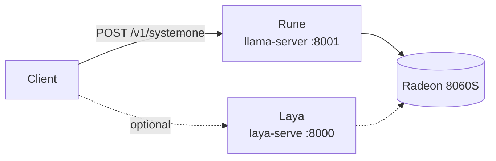
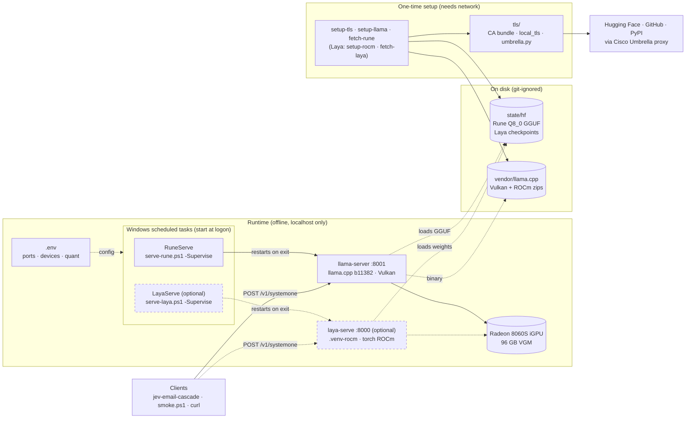

# local-decision-model

> **IT team:** start with [docs/IT-HANDOFF.md](docs/IT-HANDOFF.md). It covers running this machine as delivered, rebuilding it from scratch, and connecting it to TrueFoundry.

## Purpose

This project runs a **decision model** on our own Strix Halo box (Ryzen AI MAX+ 395 / Radeon 8060S, Windows 11). A decision model reads some text, such as an email, and answers a fixed set of questions about it. For example: "which team owns this?", "how urgent is it?", "is the sender waiting for a reply?". It picks from the answers you allow and says how sure it is. It doesn't write prose.

We use this for email triage today through a hosted service, TypeSafe's Jev. Running the model locally has three benefits:

- **The email never leaves our hardware.**
- **No per-email cost.**
- **No dependence on an outside service.**

The default model, **Rune 26B-A4B v3**, matched Jev's accuracy on our 74-email benchmark (see [Results](#results)). The server speaks Jev's own `POST /v1/systemone` protocol, so existing Jev clients only need a new URL. A second, smaller model, **Laya**, is available as an option.

| | model | server | port | GPU path | task |
| --- | --- | --- | --- | --- | --- |
| **default** | **Rune 26B-A4B v3** (Invergent, Gemma 4 MoE, 4B active) | llama.cpp `llama-server` b11382 | 8001 | Vulkan | `RuneServe` |
| optional | **Laya** (Convai Innovations, 421M encoder; PyPI `laya` 0.3.26) | `laya-serve` | 8000 | ROCm torch (`.venv-rocm`) | `LayaServe` |

This project was named `laya-host` until Rune was added.

## Architecture

At runtime:



All the moving parts, including setup (dashed boxes are optional Laya parts):



- **Clients** send the request: a state plus typed questions in, typed answers with probabilities out. Laya takes the same request, if you run it.
- **A scheduled task keeps each server up.** It runs a small PowerShell supervisor, which restarts the server whenever it exits. `.env` decides ports, devices and which Rune quant to load.
- **Rune runs on the iGPU** through llama.cpp's `llama-server`, using Vulkan; that's the only llama.cpp build that sees this GPU. Optional Laya runs through `laya-serve` on AMD's ROCm build of torch, on the same GPU.
- **Everything at runtime is local.** Servers bind to 127.0.0.1 and load weights from `state/hf` with `HF_HUB_OFFLINE=1`.
- **Network is only needed for setup.** The setup scripts download weights and the llama.cpp zips (and, for Laya, the ROCm torch wheels). They go through `tls/` because the corporate Cisco Umbrella proxy re-signs and redirects those downloads; see [Why it is shaped like this](#why-it-is-shaped-like-this).

## Setup (one time): Rune

```powershell
uv sync                                   # .venv on Python 3.13 (downloads + proxy only; Laya is an extra)
.\scripts\setup-tls.ps1                   # CA bundle + Python 3.13 strict-X509 hook (corporate proxy)
Copy-Item .env.example .env
.\scripts\setup-llama.ps1                 # llama.cpp b11382 win-vulkan + win-rocm zips -> vendor\llama.cpp\
.\scripts\fetch-rune.ps1                  # Rune Q8_0, 25 GB, into state\hf through the proxy
.\scripts\install-task.ps1 -StartNow      # scheduled task "RuneServe": starts at logon, restarts on exit
.\scripts\smoke.ps1                       # health + one typed request
```

Or, with make: `make setup`.

The weights are `owao/surogate-rune-26b-a4b-systemone` at revision `f6cf5c19`. These are Invergent's weights, unmodified, with five GGUF header keys added: decision type `openjev`, temperature 2 per question type, and the surogate decision prompt template. With those keys, `llama-server` (b11371 and later, PR #29818) serves `/v1/systemone` for Rune with no extra flags. The official repo (`surogate/rune-26b-a4b-GGUF`) is gated, holds bf16 safetensors, and is meant for Invergent's surogate engine on NVIDIA. Rune's optional `thinking` mode exists only in surogate, so here Rune runs single-pass, which is the 57.44 Decision Index configuration.

`.env` picks the quant (`RUNE_GGUF`), the llama.cpp build (`RUNE_LLAMA_BACKEND`), the context (`RUNE_CTX`), the parallel slots (`RUNE_PARALLEL`) and the micro-batch (`RUNE_UBATCH`, default 512). Only the Vulkan build sees the 8060S: the official `win-rocm` zip lists no devices with this driver.

**Use Q8_0, the default.** `fetch-rune.ps1 BF16` will fetch BF16 (47 GB), and it loads, but every request fails with `vk::Queue::submit: ErrorDeviceLost` on b11382 Vulkan with driver 32.0.31041, even at `RUNE_UBATCH=128`. The device-lost state leaves the GPU in a bad state until a restart. Livesport's measurements put Q8_0 at 98.7% top-option agreement with bf16 (KL 0.0094).

## Request shape

```json
{"state": {"subject": "...", "body": "..."},
 "questions": {
   "dept":    {"type": "choice", "instructions": "Which team?", "criteria": {"billing": "refunds", "tech": "bugs"}},
   "urgency": {"type": "score",  "instructions": "How urgent?", "criteria": ["routine", "soon", "blocking"]},
   "cancel":  {"type": "noul",   "instructions": "Does the customer explicitly threaten to cancel?"}}}
```

Rune's `llama-server` has these routes:
- `GET /health`
- `GET /props`: the GGUF path and the build
- `POST /v1/systemone`

It has no batch route. Instead it runs `RUNE_PARALLEL` requests in parallel.

## Results

Measured 2026-10-04 on 74 labelled emails with 8 questions each, using `cascade run` and `scripts/bench_laya.py` in [jev-email-cascade](https://github.com/skiingfalcon/jev-email-cascade). Jev and frontier are the hosted baselines. There's a plain-language write-up of all the models in [docs/decision-models.md](https://github.com/skiingfalcon/jev-email-cascade/blob/25ae95d8b6f9c1cb9c64b560163133117b57e44b/docs/decision-models.md).

| model | category acc | macro F1 | priority exact / ±1 | noul Brier / ECE | p50 per email | throughput | GPU memory |
| --- | ---: | ---: | ---: | ---: | ---: | ---: | ---: |
| Jev 1.13 (hosted) | 0.959 | 0.955 | 0.784 / 0.919 | 0.079 / 0.097 | 272 ms | | |
| gpt-5.6-terra (hosted) | 0.973 | 0.967 | 0.905 / 1.000 | 0.071 / 0.072 | 1,600 ms | | |
| **Rune 26B-A4B v3 Q8_0**, Vulkan | **0.959** | **0.958** | 0.743 / **1.000** | 0.090 / 0.113 | 2,080 ms | 0.48 emails/s | 26.9 GB |
| Laya `typed-decisions`, ROCm (optional) | 0.784 | 0.789 | 0.405 / 0.811 | 0.165 / 0.149 | 274 ms | 3.4 emails/s | 7.5 GB+ |
| Laya `english`, CPU | 0.649 | 0.638 | 0.230 / 0.811 | 0.189 / 0.116 | 2,040 ms | 0.4 emails/s | 5 GB RAM |

- **Rune** matches Jev on category and is never more than one level off on priority, at $0.
  - It costs about 8× the latency, which is still about 1,700 emails an hour.
  - The GPU is saturated processing each prompt (about 2,300 tokens per email), so `RUNE_PARALLEL=4` doesn't help (0.43 vs 0.48 emails/s).
- **Laya** is fast but well short on accuracy for this taxonomy.
- **Routing.** jev-email-cascade's routing policy is conservative for every backend: it sends 70 of 74 Jev emails, 71 Rune emails and all 74 Laya emails to human review.

## Day to day

| | Rune (default) | Laya (optional) |
| --- | --- | --- |
| stop (task + port) | `.\scripts\stop.ps1` | `.\scripts\stop.ps1 -Model laya` |
| start | `Start-ScheduledTask RuneServe` | `Start-ScheduledTask LayaServe` |
| unregister | `.\scripts\install-task.ps1 -Remove` | `.\scripts\install-task.ps1 -Model laya -Remove` |
| foreground (debug) | `.\scripts\serve-rune.ps1` | `.\scripts\serve-laya.ps1` |
| log | `state\logs\rune.log` | `state\logs\laya.log` |
| smoke test | `.\scripts\smoke.ps1` | `.\scripts\smoke.ps1 -Server laya` |

Each task runs its serve script with `-Supervise`, which restarts the server whenever it exits. This was tested by killing each server's process: Rune was back in about 28 s, Laya in about 23 s. Task Scheduler's own restart setting only covers a failed start, so it can't do this on its own.

## Optional: Laya

Laya is a 421M-parameter encoder: about 8× faster than Rune, but much less accurate on our benchmark (see [Results](#results)). Set it up only if you need its speed, or want a second opinion.

```powershell
uv sync --extra laya                      # laya[serve] + ONNX packages in .venv (CPU fallback, weight fetch)
.\scripts\setup-tls.ps1                   # re-install the TLS hook into the re-synced .venv
.\scripts\setup-rocm.ps1                  # .venv-rocm: AMD's torch 2.11.0+rocm7.13.0 for gfx1151, + laya
.\scripts\fetch-laya.ps1                  # ~2.3 GB into state\hf, through the proxy
.\scripts\install-task.ps1 -Model laya -StartNow   # scheduled task "LayaServe" on :8000
.\scripts\smoke.ps1 -Server laya
```

Or: `make laya-sync laya-rocm laya-weights laya-install laya-smoke`.

A request may also name a Laya checkpoint with `"model"`: `english`, `typed-decisions` (best on our emails) or `multilingual`. If you leave it out, Laya's router chooses. `laya-serve` adds `POST /v1/systemone/batch` (up to 64 states sharing one question set), and its `GET /health` lists the resident checkpoints, their revision SHAs and the device each one computes on.

### Laya: GPU (ROCm) vs CPU

`.env` selects the environment and device:
- `LAYA_VENV=.venv-rocm` with `LAYA_DEVICE=cuda` (torch's name for the HIP device). This is the default.
- To fall back to CPU, comment out `LAYA_VENV` and set `LAYA_DEVICE=cpu`. That uses `.venv` after `uv sync --extra laya`.

| | p50 / p95 per email | throughput | memory |
| --- | ---: | ---: | --- |
| ROCm, Radeon 8060S | 245 / 265 ms | 4.0 emails/s | 7.5 GB GPU after load. torch's allocator caches up to 59 GB after batch-64 calls, until restart |
| CPU, 16 threads | 2,400 / 2,550 ms | 0.4 emails/s | 5 GB RSS |

On these 74 emails, both devices give the same answers to within float noise. Notes:
- The first request after a start takes about 1.9 s while ROCm kernels load.
- `laya-serve` runs one inference at a time, so concurrency only adds queueing. The batch route didn't increase throughput on this hardware either.
- Keep `.venv-rocm` at a short path. rocBLAS kernel-library paths otherwise exceed Windows' 260-character limit (`LongPathsEnabled=0` here), and every GEMM then crashes with `0xC0000005`.

## Why it is shaped like this

- **Cisco Umbrella intercepts huggingface.co.** Its root isn't in the Windows store, and Python 3.13's strict X.509 mode rejects its leaf certificates. It also redirects every `/resolve/` download through an OpenDNS session handshake.
  - `scripts/setup-tls.ps1` builds `state/certs/ca-bundle.pem` (certifi + Cisco's published Umbrella root, fingerprint-checked).
  - `tls/local_tls.py` clears only the strict flag. It's gated by `LOCAL_TLS_RELAX_STRICT=1`.
  - `tls/umbrella.py` completes the handshake for huggingface_hub and for `scripts/download.py`. The session cookie arrives on the first 302 and has to travel on every hop until Hugging Face itself answers.
  - GitHub release assets go through the same proxy, so `setup-llama.ps1` downloads with Python rather than `Invoke-WebRequest`.
  - Files over huggingface_hub's 50 GB limit for non-xet downloads (Rune BF16) are streamed by `download.py`, resumably and SHA-256 checked.
  - Weights are fetched once (`fetch-rune.ps1`, `fetch-laya.ps1`), and the servers run with `HF_HUB_OFFLINE=1`.
  - `HF_HUB_DISABLE_XET=1`, because the Rust xet client ignores Python's CA settings.
  - Nothing is added to the Windows certificate store.
- **Memory.**
  - 128 GB is installed and 96 GB is already carved out for the iGPU. Rune Q8_0 uses 27 GB of that, and Laya keeps all three checkpoints resident (`LAYA_MAX_LOADED=3`).
  - Don't raise VGM: Windows needs the ~32 GB it keeps for CPU-side work.
- **Pinned weights.** Rune is pinned to owao's revision `f6cf5c19`. `LAYA_REVISION=reviewed` uses the SHAs the installed laya release reviewed (`laya/revisions.py`).
- **No ONNX/DirectML for Laya.** laya 0.3.26's `laya-serve` only runs torch, and its `ONNXAgent` only tries the CUDA or CPU providers. The GPU path is ROCm torch instead. `onnxruntime-directml` is included in the `laya` extra in case a later laya release adds a DirectML path.
