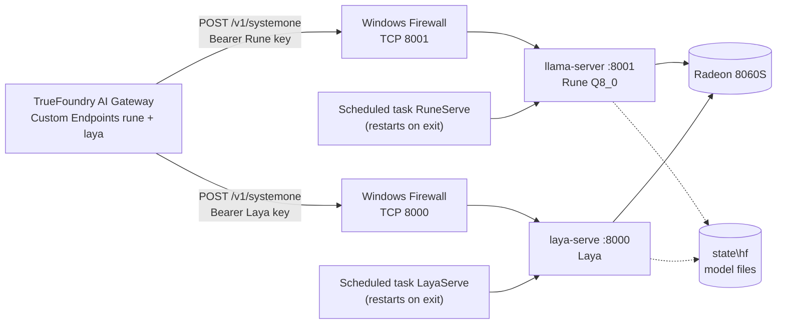

# IT handoff: local decision-model server (AMDHALO-CT3)

*Prepared 2026-10-04 for the IT team taking over this machine and connecting it to TrueFoundry.*

## What this machine does

This mini-PC runs two AI "decision models" as small web services on the local network. An
application sends one of them some text (for example an email) plus a list of questions, such as
"which team should handle this?" or "is it urgent?". The model returns an answer to each question
with a confidence score. Both speak the same API (`POST /v1/systemone`), so a client can switch
between them by changing the URL.

| | **Rune** (main model) | **Laya** (second model) |
| --- | --- | --- |
| port | **8001** | **8000** |
| accuracy on our 74-email benchmark | as good as the paid cloud service (TypeSafe Jev) | clearly lower |
| speed, one request at a time | ~2 s per email | ~0.25 s per email |
| use it for | the real decisions | fast first-pass or second-opinion calls |

- Neither generates free text, and neither calls out to the internet while serving. The models
  and all their files are on this machine.
- Both share the one GPU. Running both is fine (tested, see below), but each is slower while the
  other is busy.

Your job, in short:
1. Keep both services running.
2. Make them reachable from TrueFoundry, each protected by its own API key.
3. Register **both** in TrueFoundry's AI Gateway, as two Custom Endpoints.

The document covers two scenarios:

- **[Scenario A](#scenario-a-use-the-machine-as-is)**: the machine works as delivered. Verify
  it, harden it, connect it. *(About 1 hour.)*
- **[Scenario B](#scenario-b-rebuild-from-scratch)**: the disk was wiped or the install is
  broken. Rebuild, then continue with Scenario A. *(About 1.5–2 hours, mostly downloads.)*

## At a glance

| item | value |
| --- | --- |
| hostname | `AMDHALO-CT3` (workgroup `SCG`, not domain-joined) |
| network | Wi-Fi, `192.168.1.201` (DHCP). **Recommend wired Ethernet with a reserved IP.** |
| hardware | AMD Ryzen AI MAX+ 395, Radeon 8060S iGPU, 128 GB RAM, 1.7 TB free on C: |
| GPU memory | 96 GB of the RAM is reserved for the GPU (AMD Adrenalin, "Variable Graphics Memory"). Windows sees ~32 GB. |
| OS / driver | Windows 11 Enterprise 10.0.26200; AMD graphics driver **32.0.31041.1004** (known good) |
| power | "High performance" plan, sleep and hibernate **never** |
| Windows account | `AMDHALO-CT3\kghosh` (everything was installed per-user for this account; see [Accounts](#a6-move-off-the-kghosh-account)) |
| install folder | `C:\Users\kghosh\projects\local-decision-model` |
| source code | https://github.com/skiingfalcon/local-decision-model-halo (public, branch `main`) |
| **service 1: Rune** | **Rune 26B-A4B v3** (Q8_0) on llama.cpp `llama-server` b11382 (Vulkan), **port 8001** |
| **service 2: Laya** | **Laya** 0.3.26 (`laya-serve`, three small checkpoints) on AMD's ROCm build of PyTorch, **port 8000** |
| service runners | Windows Scheduled Tasks **`RuneServe`** and **`LayaServe`**: both start at logon of `kghosh` and restart their server if it stops |
| Rune endpoints | `GET /health` (no auth) · `POST /v1/systemone` (the API) · `GET /props` (model and build info). `/metrics` is **off on purpose**; see [A7](#a7-monitoring-with-datadog-optional). |
| Laya endpoints | `GET /health` (status open, details need the key) · `POST /v1/systemone` (the API) · `POST /v1/systemone/batch` (up to 64 emails per call) |
| logs | `state\logs\rune.log` and `state\logs\laya.log` in the install folder |



### What has and hasn't been tested

| | status |
| --- | --- |
| Rune answers correctly on this machine (74-email benchmark, smoke test) | ✅ tested |
| Laya answers correctly on this machine (74-email benchmark, smoke test) | ✅ tested |
| Rune alone, one user, 370 requests back to back after a clean reboot: 0 errors, median 2.07 s, GPU memory flat at 26.9 GB | ✅ tested 2026-10-04 |
| **Rune and Laya together**, one user on each at the same time (148 Rune + 740 Laya requests): 0 errors, no GPU faults. Rune median 3.7 s, Laya median 0.54 s while sharing the GPU | ✅ tested 2026-10-04 |
| The scheduled tasks restart a server after it is killed (Rune back in ~28 s, Laya ~23 s) | ✅ tested |
| Rune API key: `/v1/systemone` returns **401** without or with a wrong key, **200** with the right one; `/health` stays open | ✅ tested (on localhost) |
| Laya API key (`LAYA_API_KEY`) | ⚠️ not yet tested on this machine; built into `laya-serve` and covered by its own tests |
| Rune `/metrics` (`RUNE_METRICS=1`) | ❌ **don't use.** With it on, Rune hit a GPU fault (`ErrorDeviceLost`) on its first requests, even right after a reboot. It is off by default. |
| Access from another machine on the network / firewall rule | ⚠️ not yet tested |
| Running while nobody is logged on, or under an account other than `kghosh` | ⚠️ not yet tested (see [A2](#a2-make-it-always-on), [A6](#a6-move-off-the-kghosh-account)) |
| TrueFoundry connection | ⚠️ not yet tested; steps below follow TrueFoundry's documentation |
| Datadog configs in `monitoring\datadog\` | ⚠️ not yet tested; written from Datadog's documentation and checked against this machine's counters and endpoints |

---

## Scenario A: use the machine as-is

### A1. Check that it's running

Log in as `kghosh`, or as a local admin using an elevated PowerShell. Then run:

```powershell
cd C:\Users\kghosh\projects\local-decision-model
Get-ScheduledTask RuneServe, LayaServe | Select-Object TaskName, State   # expect: Running, Running
Invoke-RestMethod http://127.0.0.1:8001/health                     # Rune: expect status ok
Invoke-RestMethod http://127.0.0.1:8000/health                     # Laya: expect status ok
.\scripts\smoke.ps1                                                # Rune: expect department = billing ...
.\scripts\smoke.ps1 -Server laya                                   # Laya: expect department = billing ...
```

Each smoke test sends one sample request ("we were billed twice... refund or we cancel") and
prints the model's answers. Expect `department = billing` from both. Rune's round trip is about
0.5 s. Laya's first request after a start takes about 2 s while GPU kernels load, then about 0.25 s.

If any of this fails, see [Troubleshooting](#troubleshooting).

### A2. Make it always-on

The `RuneServe` and `LayaServe` tasks start **when `kghosh` logs on**, so after a reboot
nothing serves until someone logs in. The power plan already keeps the box awake. Pick one of these:

- **Option 1: auto-logon (simplest, matches what was tested).** Configure Windows to log
  `kghosh` on at boot, for example with Sysinternals **Autologon**, which stores the password
  encrypted. Then lock the screen with a policy if needed. The task starts exactly as tested.
- **Option 2: start at boot with nobody logged on.** Re-register the task for an account and
  start it at boot. Run this from an elevated PowerShell in the install folder; it prompts for
  that account's password, which Task Scheduler stores:

  ```powershell
  .\scripts\install-task.ps1 -RunAs AMDHALO-CT3\<account> -AtStartup
  .\scripts\install-task.ps1 -Model laya -RunAs AMDHALO-CT3\<account> -AtStartup
  ```

  The account can be `kghosh`, or better, an IT service account after [A6](#a6-move-off-the-kghosh-account).

  ⚠️ **Untested.** The server then runs in a non-interactive session, and GPU (Vulkan) access
  from there hasn't been verified on this machine. Reboot without logging in, then check
  `Invoke-RestMethod http://<host>:8001/health` and run a real request from another machine. If
  requests fail, check `rune.log` and fall back to Option 1. Auto-logon works with any account.

Also plan for **Windows Update reboots** (for example, a maintenance window). The service comes
back on its own after the reboot, given Option 1 or 2.

### A3. Open both to the network, with API keys

By default both servers only listen on `127.0.0.1` with no key. To serve TrueFoundry, do these
steps for **both** Rune (port 8001) and Laya (port 8000):

1. **Pick two API keys**, one for Rune and one for Laya. Use long random strings, kept in your
   secret store. Run this twice:

   ```powershell
   -join ((48..57 + 65..90 + 97..122) | Get-Random -Count 48 | ForEach-Object { [char]$_ })
   ```

   Separate keys let you revoke one model's access without touching the other.

2. **Edit `C:\Users\kghosh\projects\local-decision-model\.env`.** The Rune settings are in the
   Rune section, the Laya ones in the Laya section:

   ```ini
   # Rune section
   RUNE_HOST=0.0.0.0
   RUNE_API_KEY=<Rune key from step 1>
   RUNE_METRICS=0            # leave at 0; see A7

   # Laya section
   LAYA_HOST=0.0.0.0
   LAYA_API_KEY=<Laya key from step 1>
   ```

   With a key set, every request except `/health` needs the header
   `Authorization: Bearer <key>`. Laya's `/health` still answers `{"status":"ok"}` without the
   key, but only shows its details (loaded checkpoints, device) with it.

3. **Allow both ports through Windows Firewall.** Limit them to the addresses TrueFoundry
   connects from (or your gateway/VPN subnet):

   ```powershell
   New-NetFirewallRule -DisplayName "Rune decision model (TCP 8001)" -Direction Inbound `
     -Protocol TCP -LocalPort 8001 -Action Allow -Profile Domain,Private `
     -RemoteAddress <TrueFoundry egress IPs or subnet>
   New-NetFirewallRule -DisplayName "Laya decision model (TCP 8000)" -Direction Inbound `
     -Protocol TCP -LocalPort 8000 -Action Allow -Profile Domain,Private `
     -RemoteAddress <TrueFoundry egress IPs or subnet>
   ```

   The network currently shows as `Private`. If yours is `Public`, add that profile, or better,
   fix the network category.

4. **Restart both services** to pick up `.env`. Do it when no requests are in flight:

   ```powershell
   .\scripts\stop.ps1;              Start-ScheduledTask RuneServe
   .\scripts\stop.ps1 -Model laya;  Start-ScheduledTask LayaServe
   ```

5. **Test from another machine.** The request below is for Rune; repeat it with port `8000` and
   the Laya key for Laya:

   ```bash
   curl http://<AMDHALO-CT3 IP>:8001/health
   curl -X POST http://<AMDHALO-CT3 IP>:8001/v1/systemone \
     -H "Authorization: Bearer <Rune key>" -H "Content-Type: application/json" \
     -d '{"state":{"body":"We were billed twice for March. Refund the duplicate or we cancel."},
          "questions":{"dept":{"type":"choice","instructions":"Which team should handle this?",
                       "criteria":{"billing":"invoices, payments, refunds","technical":"bugs, outages","other":"everything else"}}}}'
   ```

   Expect `"choice":"billing"` from both. Without the header, or with the other model's key, you
   should get **401**.

The traffic is plain HTTP. If it crosses an untrusted network, put it behind your VPN, or a TLS
reverse proxy such as IIS ARR, Caddy or nginx on the box.

### A4. Connect both to TrueFoundry

**Use TrueFoundry's "Custom Endpoints".** Don't use "Self Hosted Models": that feature expects
OpenAI-style chat APIs, while this server speaks TypeSafe Jev's decision API (`/v1/systemone`).
Custom Endpoints proxy any HTTP API unchanged and inject the upstream credentials for you
([TrueFoundry docs](https://www.truefoundry.com/docs/ai-gateway/custom-endpoints)).

1. **Network path.** TrueFoundry's gateway must be able to reach `http://<host>:8001` and
   `http://<host>:8000`. If you
   use TrueFoundry's hosted (SaaS) gateway, that means a VPN, tunnel or other private
   connectivity from the gateway to this machine. If your gateway is deployed inside our network,
   the firewall rule from A3 is enough. **This is your call. Nothing on the machine assumes
   either.**
2. **Register two Custom Endpoints in the AI Gateway**, under one account, for example
   `local-decision-models`:

   | field | endpoint `rune` | endpoint `laya` |
   | --- | --- | --- |
   | Base URL (no trailing slash) | `http://<AMDHALO-CT3 IP or DNS name>:8001` | `http://<AMDHALO-CT3 IP or DNS name>:8000` |
   | Header auth: name | `Authorization` | `Authorization` |
   | Header auth: value | `Bearer <Rune key from A3>` | `Bearer <Laya key from A3>` |
   | Suggested rate limit | about 0.5 requests/s (see A5) | about 3 requests/s (see A5) |

   Each endpoint must carry its own model's key. Swapping them gives **401**.

3. **Clients then call the gateway, not the box.** Following TrueFoundry's URL pattern, they
   authenticate with their own TrueFoundry key and never see the box's keys. Only the endpoint
   name differs:

   ```
   POST {GATEWAY_BASE_URL}/proxy-api/local-decision-models/rune/v1/systemone
   POST {GATEWAY_BASE_URL}/proxy-api/local-decision-models/laya/v1/systemone
   POST {GATEWAY_BASE_URL}/proxy-api/local-decision-models/laya/v1/systemone/batch   # Laya only
   Authorization: Bearer <TrueFoundry API key>
   ```

   The request body is the same for both (see the [Appendix](#appendix-the-api-in-one-example)).
   Laya also accepts an optional `"model"` field (`english`, `typed-decisions` or
   `multilingual`). `typed-decisions` was the most accurate on our emails. If the field is left
   out, Laya picks one itself.

4. **Health check / monitoring.** `GET {...}/rune/health` and `GET {...}/laya/health`, or
   `http://<host>:8001/health` and `http://<host>:8000/health` directly, return
   `{"status":"ok"}` when the model is loaded and ready.

### A5. Day-to-day operation

PowerShell, in the install folder:

| task | Rune | Laya |
| --- | --- | --- |
| status | `Get-ScheduledTask RuneServe`; `Invoke-RestMethod http://127.0.0.1:8001/health` | `Get-ScheduledTask LayaServe`; `Invoke-RestMethod http://127.0.0.1:8000/health` |
| stop (task and port) | `.\scripts\stop.ps1` | `.\scripts\stop.ps1 -Model laya` |
| start | `Start-ScheduledTask RuneServe` (loads in ~20 s) | `Start-ScheduledTask LayaServe` (loads in ~20 s) |
| logs | `Get-Content state\logs\rune.log -Tail 50 -Wait` | `Get-Content state\logs\laya.log -Tail 50 -Wait` |
| sample request | `.\scripts\smoke.ps1` | `.\scripts\smoke.ps1 -Server laya` |
| remove the service | `.\scripts\install-task.ps1 -Remove` | `.\scripts\install-task.ps1 -Model laya -Remove` |

The smoke tests send the keys automatically once they're in `.env`.

What to expect, with 8 questions on a typical email (measured 2026-10-04):

| | Rune alone | Laya alone | both busy at once |
| --- | ---: | ---: | ---: |
| time per request (median) | 2.1 s | 0.25 s | Rune 3.7 s, Laya 0.54 s |
| requests per second | ~0.5 | ~4 | Rune ~0.3, Laya ~1.7 |
| GPU memory | 27 GB | 7.5 GB, can grow to ~59 GB after many large batch calls | up to ~86 GB of the 96 GB |
| RAM | ~1 GB | ~1 GB | ~2 GB |

- Each server processes one request at a time and queues the rest; more parallel slots didn't
  help on this GPU. If both models will be used at the same time, set the TrueFoundry rate limits
  from the "both busy at once" column.
- Laya's GPU memory only grows when clients send big `/batch` calls (up to 64 emails each), and
  it's released when Laya restarts. If GPU memory gets tight, ask clients to keep batches small,
  or restart Laya (`stop.ps1 -Model laya`, then `Start-ScheduledTask LayaServe`).

Please **don't**:
- Set `RUNE_METRICS=1`. Rune's `/metrics` page triggered a GPU fault (`ErrorDeviceLost`) on this
  machine; see A7.
- Switch `RUNE_GGUF` to the BF16 file. It crashes the GPU driver ("device lost"), and only a
  reboot recovers it.
- Lower the 96 GB GPU-memory setting below ~40 GB.
- Update the AMD graphics driver without re-running the smoke test afterwards. Vulkan behaviour
  is driver-dependent; 32.0.31041.1004 is the known-good version.

### A6. Move off the kghosh account

**Do you need `kghosh`'s login today?**
- **Clients (TrueFoundry, apps): no.** They only make HTTP calls to port 8001.
- **IT admins looking at files: no.** Local Administrators (for example `sadmin` and the `la-*`
  accounts) have full control of `C:\Users\kghosh\projects\local-decision-model`. Accept the
  Explorer permission prompt, or use an elevated PowerShell. Admins can also start and stop the
  tasks in Task Scheduler.
- **Starting the service: yes, as delivered.** `RuneServe` runs as `kghosh` and starts at
  `kghosh`'s logon.

**Rune is easy to move.** At runtime it needs only PowerShell, `vendor\llama.cpp\` (the
llama-server program), the 25 GB model file and `.env`. Python and `uv` are only used by the
setup and download scripts. To move it to a neutral folder and an IT-owned account:

1. **Create an IT service account**, for example a local user `svc-decision`. It needs no admin
   rights.
2. **Stop and unregister the old Rune task.** From an elevated PowerShell in the old folder:

   ```powershell
   cd C:\Users\kghosh\projects\local-decision-model
   .\scripts\stop.ps1; .\scripts\install-task.ps1 -Remove
   ```

   Laya can keep running from the old folder until you move it too (see the end of this section).

3. **Copy the runtime pieces** to `C:\local-decision-model`. This skips the Python
   environments, which embed absolute paths and aren't needed by Rune:

   ```powershell
   $src = 'C:\Users\kghosh\projects\local-decision-model'; $dst = 'C:\local-decision-model'
   robocopy $src $dst /E /XD "$src\.venv" "$src\.venv-rocm" "$src\state\hf" __pycache__
   $snap = 'state\hf\hub\models--owao--surogate-rune-26b-a4b-systemone\snapshots\f6cf5c19a05713cb9b2c59a57cd79e85ab8d2ffd'
   New-Item -ItemType Directory -Force "$dst\$snap" | Out-Null
   Copy-Item "$src\$snap\Rune-26B-A4B-v3-Q8_0.gguf" "$dst\$snap\"      # 25 GB
   icacls $dst /grant "AMDHALO-CT3\svc-decision:(OI)(CI)M"            # service account can write logs
   ```

4. **Register the task for the service account.** Pick one:
   - At boot, with no logon (Option 2 in A2, untested GPU access):

     ```powershell
     cd C:\local-decision-model
     .\scripts\install-task.ps1 -RunAs AMDHALO-CT3\svc-decision -AtStartup -StartNow
     ```

   - At that account's logon, combined with auto-logon of `svc-decision` (Option 1):

     ```powershell
     .\scripts\install-task.ps1 -RunAs AMDHALO-CT3\svc-decision
     ```

5. **Verify** with `.\scripts\smoke.ps1` (from `C:\local-decision-model`) and a request from
   another machine.
6. **Optionally** delete the old folder once satisfied (or keep it as a backup), and update the
   Datadog log path (A7, if you use Datadog) to `C:\local-decision-model\state\logs\rune.log`.

`git pull` in the new folder still works for updates, since `.git` was copied. To re-run the
download or setup scripts there, install Python 3.13 and `uv` for the account doing it
([B1](#b1-tools)) and run `uv sync` first.

**Laya takes more work to move**, because its Python environments embed absolute paths and must
be rebuilt in the new folder:
1. In `C:\local-decision-model`, run the Laya setup from [B5](#b5-install-laya) (about 15
   minutes). You can skip `fetch-laya.ps1` by copying the `models--convai*` folders from the old
   `state\hf\hub`.
2. In the old folder, stop and unregister its task:
   `.\scripts\stop.ps1 -Model laya; .\scripts\install-task.ps1 -Model laya -Remove`.
3. In the new folder, register it for the same account:
   `.\scripts\install-task.ps1 -Model laya -RunAs AMDHALO-CT3\svc-decision -StartNow`. Add
   `-AtStartup` if you chose that for Rune.
4. Verify with `.\scripts\smoke.ps1 -Server laya`.

### A7. Monitoring with Datadog (optional)

> **Optional.** Skip this section until the organization is onboarded to Datadog. Nothing else depends on it: the services run the same without an Agent.

> **Don't turn on Rune's `/metrics` page (`RUNE_METRICS=1`).** On 2026-10-04, every Rune start with llama-server's `--metrics` flag hit a GPU fault (`ErrorDeviceLost`) on its first requests. That happened even right after a reboot, with nothing else on the GPU. The same setup without the flag then served 370 requests with no errors. So the flag is off in `.env`, and the OpenMetrics check below is **not** part of the setup. Use the GPU performance counters, the HTTP checks and the logs instead.

Ready-made Agent configs are in the repo under
[`monitoring\datadog\conf.d\`](../monitoring/datadog/conf.d). They cover both Rune and Laya:

| what | Datadog check | config file | key signals |
| --- | --- | --- | --- |
| Are Rune and Laya up and ready? | HTTP check | `http_check.d\conf.yaml` | `http.can_connect` / service check on each `/health` (no key needed) |
| Are the processes alive, and their CPU/RAM? | Process check | `process.d\conf.yaml` | `llama-server.exe` (Rune) and `laya-serve` (Laya) running, CPU, memory |
| GPU memory and load | Windows performance counters (Agent 7.33+) | `windows_performance_counters.d\conf.yaml` | GPU dedicated memory (about 35 GB normal with both), GPU engine utilization |
| Errors | Log collection | `local_decision_model.d\conf.yaml` | `rune.log` lines containing `ErrorDeviceLost` or `exited (`; `laya.log` lines containing `0xC0000005` or `exited (` |
| ~~Load and throughput~~ | ~~OpenMetrics check~~ | `openmetrics.d\conf.yaml` | **Don't deploy.** It needs `RUNE_METRICS=1` (see the warning above). |

Datadog's built-in GPU monitoring targets NVIDIA. For this AMD Radeon, the Windows performance
counters are the source; they're the same numbers Task Manager shows.

**Steps (elevated PowerShell):**

1. **Install the Agent** using your org's API key and Datadog site:

   ```powershell
   Start-Process msiexec -Wait -ArgumentList '/qn','/i','https://s3.amazonaws.com/ddagent-windows-stable/datadog-agent-7-latest.amd64.msi','APIKEY="<DATADOG_API_KEY>"','SITE="<datadoghq.com or your site>"'
   ```

   If your org deploys the Agent with SCCM or Intune, use that instead.
2. **Check that Rune's metrics endpoint is off:** `.env` must say `RUNE_METRICS=0`.
3. **Copy the configs, leaving out OpenMetrics:**

   ```powershell
   Copy-Item -Recurse -Force <install folder>\monitoring\datadog\conf.d\* C:\ProgramData\Datadog\conf.d\ -Exclude openmetrics.d
   ```

   Then edit them in `C:\ProgramData\Datadog\conf.d\`:
   - `local_decision_model.d\conf.yaml`: set both log paths (`rune.log`, `laya.log`) to your install folder. The file
     assumes `C:\local-decision-model` (after A6). As delivered it's
     `C:\Users\kghosh\projects\local-decision-model\state\logs\rune.log`.
4. **Enable log collection.** In `C:\ProgramData\Datadog\datadog.yaml`, set `logs_enabled: true`.
   Then give the Agent's account read access to the logs folder:

   ```powershell
   icacls <install folder>\state\logs /grant "ddagentuser:(OI)(CI)R"
   ```

   Under `C:\Users\kghosh\...` the Agent can't read files without this grant. That's another
   reason to move the install (A6).
5. **Restart the Agent and check:**

   ```powershell
   & "$env:ProgramFiles\Datadog\Datadog Agent\bin\agent.exe" restart-service
   & "$env:ProgramFiles\Datadog\Datadog Agent\bin\agent.exe" status    # look for http_check, process, windows_performance_counters, logs
   ```

**Suggested monitors:**

| monitor | condition | action |
| --- | --- | --- |
| Rune or Laya down | HTTP check on that `/health` failing for 2+ minutes | Check the task and its log. The supervisor normally restarts it within ~30 s. |
| GPU fault | `rune.log` contains `ErrorDeviceLost`, or `laya.log` contains `0xC0000005` | **Reboot the machine.** Both models stop answering until the GPU is reset. Check that `.env` still says `RUNE_METRICS=0`. |
| Restart loop | more than 3 `exited (` lines in either log in 15 minutes | Check the log; usually the GPU fault above |
| Slow responses | TrueFoundry latency for Rune above ~10 s, or for Laya above ~2 s | Clients are sending faster than the rates in A5. Rate-limit in TrueFoundry. |
| GPU memory | dedicated usage > 88 GB | Laya grew after large batch calls (restart Laya), or a second copy of a server is running |

### Backups

Everything except `state\` and `vendor\` is in Git. Back up `state\hf` (and `.env`, which holds
your API key) if you want a restore without re-downloading.
- `Rune-26B-A4B-v3-Q8_0.gguf` (25 GB) is the file that matters for Rune, and the
  `models--convai*` folders (~2.3 GB) for Laya.
- The `BF16` file (47 GB) is unused and can be deleted to save space.

---

## Scenario B: rebuild from scratch

Use this if the disk was wiped or the install is broken beyond the
[Troubleshooting](#troubleshooting) fixes. All commands are PowerShell. Steps 0–2 need admin
rights only where noted.

### B0. Machine settings

1. **AMD Software (Adrenalin) → Performance → Tuning → Variable Graphics Memory:** set to
   **96 GB**, then reboot. This can't be set by script.
2. **Graphics driver:** 32.0.31041.1004 is known good. Newer drivers are probably fine; verify
   with the smoke test.
3. **Power plan:** High performance, sleep and hibernate never.

   ```powershell
   powercfg /setactive SCHEME_MIN
   powercfg /change standby-timeout-ac 0
   powercfg /change hibernate-timeout-ac 0
   ```

4. **Network:** wired with a reserved IP, if possible.

### B1. Tools

```powershell
winget install --id Python.Python.3.13 -e        # Python 3.13 (the project requires 3.13)
winget install --id astral-sh.uv -e              # uv (Python package/env manager)
winget install --id Git.Git -e                   # git
# open a NEW PowerShell window so PATH picks these up
```

### B2. Get the code

```powershell
mkdir C:\Users\<user>\projects -Force; cd C:\Users\<user>\projects
git clone https://github.com/skiingfalcon/local-decision-model-halo local-decision-model
cd local-decision-model
```

Keep the folder path **short**. This matters for the optional Laya GPU setup (see
Troubleshooting), and costs nothing for Rune.

### B3. Install and configure

```powershell
uv sync                                    # Python environment for the download helpers
.\scripts\setup-tls.ps1                    # trust bundle for the corporate proxy (see note below)
Copy-Item .env.example .env                # then set RUNE_HOST / RUNE_API_KEY as in A3
.\scripts\setup-llama.ps1                  # downloads llama.cpp b11382 (Vulkan + ROCm builds, ~280 MB)
.\scripts\fetch-rune.ps1                   # downloads the Rune Q8_0 model, 25 GB (~20–30 min at 20 MB/s)
```

`setup-llama.ps1` should print `Vulkan0: AMD Radeon(TM) 8060S Graphics` for the Vulkan build.
The ROCm build listing `(none)` is expected and harmless.

**About the proxy.** This network runs Cisco Umbrella, which intercepts huggingface.co and
GitHub downloads. The scripts handle it on their own:
- a trust bundle containing Cisco's published root, fingerprint-checked,
- a small Python TLS adjustment,
- an automatic step through Umbrella's session redirect.

Nothing is added to the Windows certificate store. On a network without Umbrella the same
scripts work unchanged. If downloads still fail, see Troubleshooting.

**Shortcut:** if you have a backup of `state\hf`, copy it into the new folder and skip
`fetch-rune.ps1`.

### B4. Install the service and test

```powershell
.\scripts\install-task.ps1 -StartNow       # registers + starts the RuneServe scheduled task
.\scripts\smoke.ps1                        # expect: department = billing ...
```

`make setup` runs B3 and B4 in one go, if `make` is installed.

### B5. Install Laya

```powershell
uv sync --extra laya                       # Laya packages in .venv (CPU fallback, weight downloads)
.\scripts\setup-tls.ps1                    # re-install the proxy fix into the re-synced .venv
.\scripts\setup-rocm.ps1                   # .venv-rocm: AMD's ROCm PyTorch for this GPU, plus laya
.\scripts\fetch-laya.ps1                   # ~2.3 GB of checkpoints into state\hf
.\scripts\install-task.ps1 -Model laya -StartNow   # registers + starts the LayaServe task on :8000
.\scripts\smoke.ps1 -Server laya           # expect: department = billing ...
```

Or: `make laya-sync laya-rocm laya-weights laya-install laya-smoke`. Keep the install folder path
short (see Troubleshooting).

Then continue with Scenario A: [A2](#a2-make-it-always-on) (always-on),
[A3](#a3-open-both-to-the-network-with-api-keys) (network + keys) and
[A4](#a4-connect-both-to-truefoundry) (TrueFoundry).

---

## Troubleshooting

| symptom | likely cause | fix |
| --- | --- | --- |
| `/health` doesn't answer | Task not running, or nobody logged on (see A2) | `Start-ScheduledTask RuneServe`; check `state\logs\rune.log` |
| `/health` returns **503** | Model still loading (~20 s after start) | Wait and retry |
| `rune.log` shows `ErrorDeviceLost` | GPU driver fault (seen with the BF16 file) | Make sure `.env` has `RUNE_GGUF=Rune-26B-A4B-v3-Q8_0.gguf`, then **reboot** |
| Requests return **401** | Missing or wrong `Authorization: Bearer` header | Check the key in `.env` and the TrueFoundry header auth |
| Works on the box, not from the network | `RUNE_HOST` / `LAYA_HOST` still `127.0.0.1`, or the firewall | A3 steps 2–4; `Test-NetConnection <host> -Port 8001` (and `-Port 8000`) from the client side |
| `ErrorDeviceLost` in `rune.log` on the first requests after every start | `RUNE_METRICS=1` in `.env` (llama-server `--metrics`) | Set `RUNE_METRICS=0`, reboot, then check both services |
| Laya crashes with `0xC0000005` on every request after a rebuild, while Rune is fine | `.venv-rocm` path too long for Windows (260 characters) | Keep the install folder path short; rebuild `.venv-rocm` |
| `setup-llama.ps1` lists no Vulkan device | Driver or GPU-memory setting | Reinstall the AMD driver; check VGM (B0) |
| Downloads fail with certificate errors | Corporate proxy | Re-run `.\scripts\setup-tls.ps1`. Make sure `.env` exists (it holds the CA settings). |
| Downloads stop with "missing X-Repo-Commit" | Umbrella redirect not handled | Use the provided `fetch-*.ps1` scripts, not `huggingface-cli` directly |
| Second copy of the server won't start | Two servers can't write the same `rune.log` | Run only one RuneServe per machine |
| **Both** Rune (`ErrorDeviceLost` in `rune.log`) **and** Laya (crash `0xC0000005` in `amdhip64_7.dll` in `laya.log`) fail; `/health` may still say ok | The GPU driver lost the device and stays in that state | **Reboot.** Seen on 2026-10-04 after extra test copies of llama-server were started next to the service and force-stopped. Run one Rune server per machine, and restart it (`stop.ps1`, then `Start-ScheduledTask RuneServe`) only when no requests are in flight. |

## Laya in more detail

Laya is the second, much smaller decision model on port 8000 (task `LayaServe`). It's about 8×
faster than Rune but noticeably less accurate. It's installed, running, and meant to be
registered in TrueFoundry next to Rune (A3, A4).
- It holds three checkpoints in GPU memory: `english`, `typed-decisions` and `multilingual`.
  A request can pick one with `"model"`; otherwise Laya chooses.
- `POST /v1/systemone/batch` takes up to 64 emails that share one question set. On this GPU it
  doesn't raise throughput, and it makes Laya's GPU memory grow (see A5).
- More than 16 requests in flight at once get **503** (`LAYA_MAX_CONCURRENT=16`). Clients should
  retry, or rate-limit in TrueFoundry.
- If you ever decide to retire it: `.\scripts\stop.ps1 -Model laya`, then
  `.\scripts\install-task.ps1 -Model laya -Remove`, and delete the `laya` Custom Endpoint in
  TrueFoundry. That frees 7–60 GB of GPU memory.
- To rebuild it, see [B5](#b5-install-laya).

## Appendix: the API in one example

Request:

```json
POST /v1/systemone
{
  "state": {"subject": "Duplicate charge", "body": "We were billed twice for March. Please refund the duplicate today or we will cancel."},
  "questions": {
    "department": {"type": "choice", "instructions": "Which team should handle this request?",
                   "criteria": {"billing": "invoices, payments, refunds", "technical": "bugs, outages, errors", "other": "everything else"}},
    "urgency":    {"type": "score",  "instructions": "How urgent is the request?", "criteria": ["routine", "soon", "blocking"]},
    "churn_risk": {"type": "noul",   "instructions": "Does the customer explicitly threaten to cancel?"}
  }
}
```

Response (real output from this machine, numbers rounded):

```json
{
  "model": "C:\\Users\\kghosh\\...\\Rune-26B-A4B-v3-Q8_0.gguf",
  "answers": {
    "department": {"type": "choice", "choice": "billing",
                   "probabilities": {"billing": 0.986, "other": 0.013, "technical": 0.001}, "confidence": 0.979},
    "urgency":    {"type": "score", "score": 1.32, "legend": {"0": "routine", "1": "soon", "2": "blocking"},
                   "probabilities": {"0": 0.035, "1": 0.607, "2": 0.358}, "confidence": 0.41},
    "churn_risk": {"type": "noul", "noul": 0.995}
  },
  "usage": {"input_tokens": 428, "output_tokens": 0}
}
```

The `model` field contains the model file's full local path. If you'd rather not expose a
Windows username to API clients, strip it in TrueFoundry or move the install out of the user
profile.

The three question types:
- `choice`: pick one of the listed options.
- `score`: a level on an ordered scale, reported as a weighted average of the levels.
- `noul`: the probability that a statement is true.

The full benchmark and model comparison are in
[jev-email-cascade/docs/decision-models.md](https://github.com/skiingfalcon/jev-email-cascade/blob/25ae95d8b6f9c1cb9c64b560163133117b57e44b/docs/decision-models.md).
